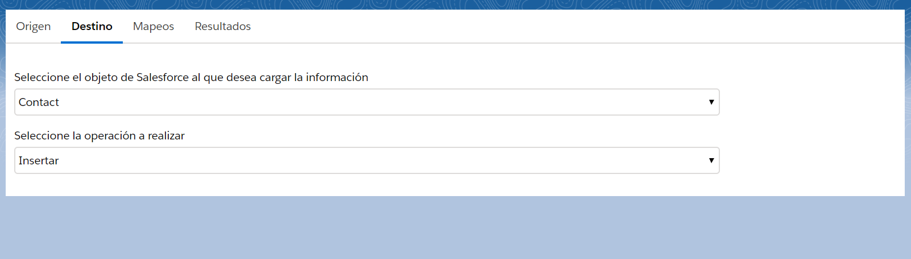

IMPORTATOR
------------

Bienvenido al importador de datos mas rapido y sencillo para Salesforce, realizado con Lightning Web Components para una integracion con Salesforce perfecta.

El componente se puede agregar donde sea necesario, una pestaña, aplicacion, comunidad etc..

Esta estructurado como los ETLs mas potentes del mercado. Eligiendo, origen, destino, mapeos y visualización del resultado final.

En el origen, podremos elegir entre fichero CSV y EXCEL. De forma automatica podremos visualizar un preview de los registros a importar

En la pestaña destino eligiremos el objeto de Salesforce y la operación que queramos realizar, inserción o actualización.

Después, en la pestaña mapeos, eligiremos el mapeo correspondiente entre las columnas de nuestro fichero y los campos de Salesforce. Pero, si nuestras columnas coinciden con los campos de Salesforce, bastará con pulsar el boton "Automatch" para realizar el mapeo instantaneo.

En la ultima pestaña veremos el resultado final de la operación. Podremos elegir el tamaño del chunk para la importación y tendremos dos opciones para importar:

Test Importator -> Realiza la importación pero no hace commit de la operación. Perfecto para confirmar si los datos son correctos.

Inicio Importator -> Realiza la importación haciendo commit en Salesforce.

Además, se incluye una pagina visualforce que integra el componente mediente lightning out y asi lo puedas usuar en classic sin ningun problema.

